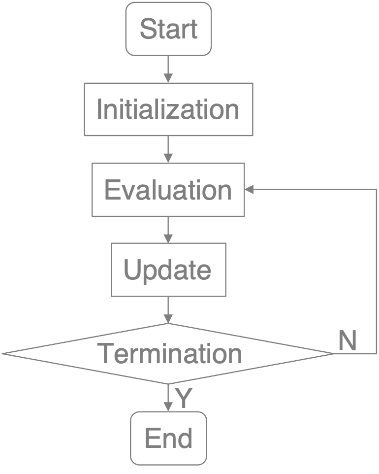

# PSO_Knapsack_problem

## knapsack problem

##### The knapsack problem is a problem in combinatorial optimization: Given a set of items, each with a weight and a value, determine the number of each item included in a collection so that the total weight is less than or equal to a given limit and the total value is as large as possible.

### Problem Definition

* Given
  * There are ten for each item
  * The maximum capacity of the knapsack is 275
  * | Item    | A   | B   | C   | D   | E   | F   | G   | H   | I   | J   |
    | :-----: |:---:|:---:|:---:|:---:|:---:|:---:|:---:|:---:|:---:|:---:|
    | Weight  | 1   | 2   | 3   | 4   | 5   | 6   | 7   | 8   | 9   | 10  |
    | Value   | 6   | 7   | 8   | 9   | 10  | 11  | 12  | 13  | 14  | 15  |

* Find
  * a set of items

* Best known solution
  * Overall weight equal to 275
  * Overall value (fitness) equal to 620
  * | Item    | A   | B   | C   | D   | E   | F   | G   | H   | I   | J   |
    | :-----: |:---:|:---:|:---:|:---:|:---:|:---:|:---:|:---:|:---:|:---:|
    | #       | 10  | 10  | 10  | 10  | 10  | 10  | 8   | 0   | 1   | 0   |

---

## Program

* main.cpp

### Argument

* ROUND: number of round
* GENERATION: number of generation
* POPULATION: number of population
* DIMENSION: there are several types of items
* MAX_POSITION: take a few at most
* MIN_POSITION: take at least a few
* CAPACITY: the maximum capacity of the knapsack
* w: weight of inertia
* c1: weight of particle best
* c2: weight of globel best

### Result

 * output.txt

### Encoding
```
/* Each bird has the following data */
int position[10];
int lastVelocity;
int pBestPosition;
int posWeight;
int fitness;
```
| Item  | A      | B      | C      | D      | E      | F      | G      | H      | I      | J      |
|:-----:|:------:|:------:|:------:|:------:|:------:|:------:|:------:|:------:|:------:|:------:|
| Index | 0      | 1      | 2      | 3      | 4      | 5      | 6      | 7      | 8      | 9      |
| Range | [0,10] | [0,10] | [0,10] | [0,10] | [0,10] | [0,10] | [0,10] | [0,10] | [0,10] | [0,10] |

---

## Particle Swarm Optimization (PSO)

##### In computational science, particle swarm optimization (PSO) is a computational method that optimizes a problem by iteratively trying to improve a candidate solution with regard to a given measure of quality. It solves a problem by having a population of candidate solutions, here dubbed particles, and moving these particles around in the search-space according to simple mathematical formula over the particle's position and velocity. Each particle's movement is influenced by its local best known position, but is also guided toward the best known positions in the search-space, which are updated as better positions are found by other particles. This is expected to move the swarm toward the best solutions.

### FlowChart



#### Initialization

```
/* For each bird */
for (int i = 0; i < DIMENSION; i++) {
    position[i] = random[MIN_POSITION, MAX_POSITION];
    lastVelocity[i] = random[MIN_POSITION, MAX_POSITION];
    pBestPosition[i] = 0;
}
posWeight = 0;
fitness = 0;
```

#### Evaluation

```
If it is not overweight:  
    fitness = #_item * value_item;

If it is overweight, remove the heaviest item：  
    fitness = #_item * value_item - #_takeAway_item * value_takeAway_item;
```

#### Update

```
/* Update particle best and globe best */
If fitness > pBestFitness:
    pBestFitness = fitness;
If pBestFitness > gBestFitness:
    gBestFitness = pBestFitness;
    
/* Update velocity */
velocity = w * lastVelocity +
          c1 * random(0, 1) * (pBestPosition - position) +
          c2 * random(0, 1) * (gBestPosition - position);

If velocity > MAX_VELOCITY:
    velocity = MAX_VELOCITY;
If velocity < MIN_VELOCITY:
    velocity = MIN_VELOCITY;

/* Update position*/
position[i] += velocity[i];
```
